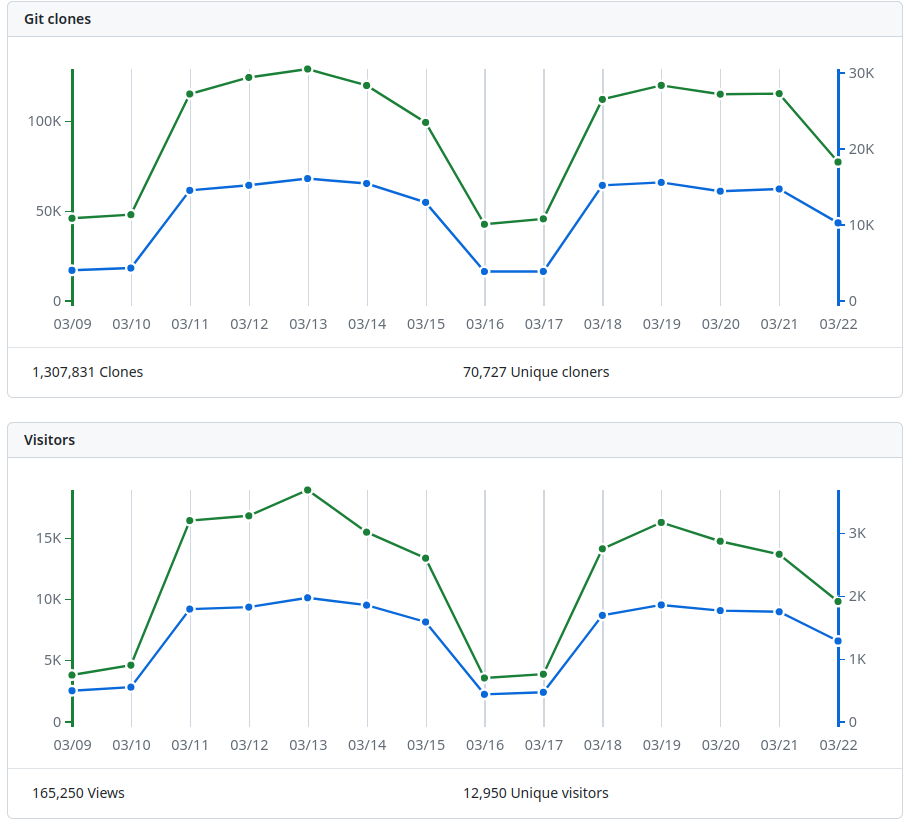
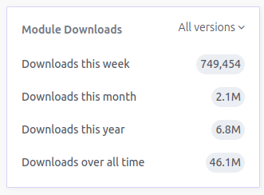

<div align="center">
  <h1>Terraform Module Data</h1>
  <p><strong>Data about Terraform module usage</strong></p>
  <p>
    <a href="https://clowdhaus.github.io/terraform-module-data/">
        clowdhaus.github.io/terraform-module-data
    </a>
  </p>
</div>

## Usage

:warning: This only works for modules in the [`terraform-aws-modules`](https://github.com/terraform-aws-modules) organization.

To collect data about a module, run the following command:

```bash
cargo run -- collect-data --module <module>
```

Where `<module>` is the name of the module you want to collect data for. For example, to collect data for the `vpc` module, run:

```bash
cargo run -- collect-data --module vpc
```

## Data Collected

Data is collected from the following sources:

1. GitHub repository - repository clones and views

This data is what can be found on the `/graphs/traffic` page of the GitHub repository. GitHub provides data for the last 14 days, aggregated by day.



1. Terraform registry - module downloads

This data is what can be found on the registry page of the module. The registry continuously updates this data, so this project collects it daily as a "snapshot in time".



### Data Directory Structure

```text
data/
├─ github/
│  ├─ eks/
│  │  ├─ clones.json
│  │  └─ views.json
│  ├─ eks-pod-identity/
│  │  ├─ clones.json
│  │  └─ views.json
│  └─ ...
└─ registry/
   ├─ eks/
   │  ├─ 2024-03-22.json
   │  ├─ 2024-03-23.json
   │  └─ ...
   ├─ eks-pod-identity/
   │  ├─ 2024-03-22.json
   │  ├─ 2024-03-23.json
   │  └─ ...
   └─ ...
```

## Development

To build and run locally, you will need to install [mdbook](https://rust-lang.github.io/mdBook/guide/installation.html)

- The theme(s) are provided by <https://github.com/catppuccin/mdBook>
  - `cargo (bin)install mdbook-catppuccin`
- Link checking is provided by <https://github.com/Michael-F-Bryan/mdbook-linkcheck>
  - `cargo (bin)install mdbook-linkcheck`
