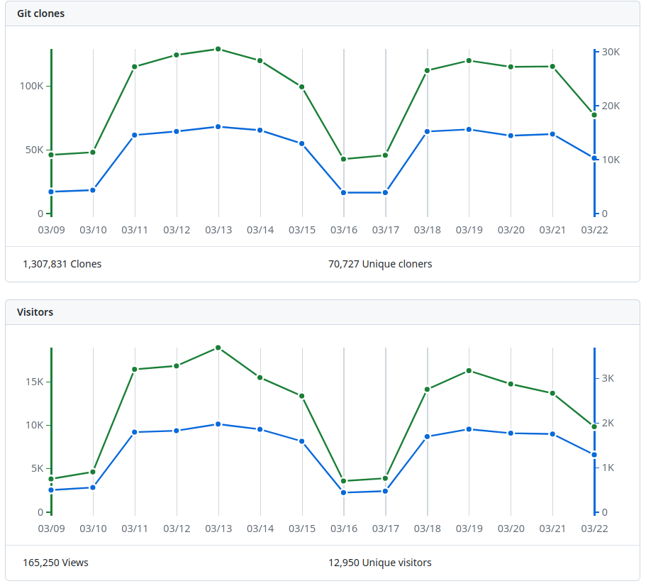
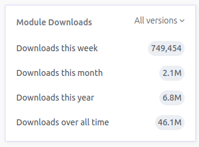

# Terraform module data

Data about Terraform module usage

## Usage

:warning: This only works for modules in the [`terraform-aws-modules`](https://github.com/terraform-aws-modules) organization. 

To collect data about a module, run the following command:

```bash
cargo run -- collect-data --module <module>
```

Where `<module>` is the name of the module you want to collect data for. For example, to collect data for the `vpc` module, run:

```bash
cargo run -- collect-data --module vpc
```

## Data Collected

Data is collected from the following sources:

1. GitHub repository - repository clones and views

This data is what can be found on the `/graphs/traffic` page of the GitHub repository:



2. Terraform registry - module downloads

This data is what can be found on the registry page of the module:



```text
data/
├─ github/
│  ├─ eks/
│  │  ├─ clones.json
│  │  └─ views.json
│  ├─ eks-pod-identity/
│  │  ├─ clones.json
│  │  └─ views.json
│  └─ ...
└─ registry/
   ├─ eks/
   │  ├─ 2024-03-22.json
   │  ├─ 2024-03-23.json
   │  └─ ...
   └─ eks-pod-identity/
      ├─ 2024-03-22.json
      ├─ 2024-03-23.json
      └─ ...
```
